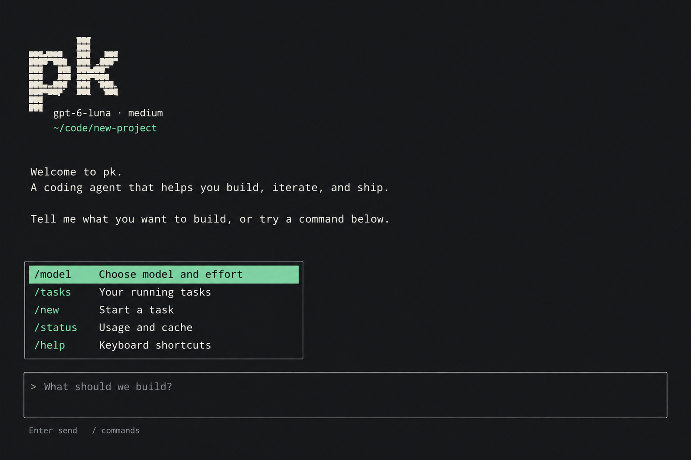

<div align="center">
  <h1>pk</h1>
  <p>Keep coding work moving.</p>
  <p>
    <a href="https://github.com/pkyanam/pk/actions/workflows/ci.yml"></a>
    
    
  </p>
  
  <p><sub>Interface concept · product screenshot coming soon</sub></p>
</div>

pk is a terminal coding workspace built on [Unreal Agent v0.1.1](https://github.com/unreallabsai/unreal-agent/tree/v0.1.1). Work in a live OpenTUI session, or hand a longer job to a durable task and come back to its progress.

## Get started

```sh
git clone https://github.com/pkyanam/pk.git
cd pk
./scripts/install       # requires Go 1.27+ and Bun
pk login
cd /path/to/project
pk
```

For work that should keep running after you leave the interface:

```sh
pk task create -p "Implement the requested change and run the relevant checks."
pk task list
pk task attach TASK_ID
```

Tasks have durable output and can be attached to, steered, canceled, or resumed. CLI-created tasks use a fresh workspace under `~/.pk/workspaces`; choose another with `--workspace DIR`.

## A workspace for longer coding work

- **See what is happening.** Follow assistant progress and live tool activity, inspect completed tool output, and answer clarification questions during foreground work.
- **Keep work moving.** Delegate bounded subtasks to child agents (using Luna by default), or detach a task and return to its saved progress later.
- **Bring your setup.** Use discovered skills, explicitly enabled plugins, and configured MCP servers. pk can also run as an ACP agent for compatible editors and clients.
- **Choose a model connection.** ChatGPT/Codex is the built-in provider. Add OpenAI-compatible Responses or Chat Completions endpoints, inspect their model lists, and select a provider for new sessions.
- **Stay in control of your session.** Context snapshots preserve the instructions, skills, and tool schemas a session started with. Provider usage and cache counters are shown when the provider reports them.
- **Update from the terminal.** Run `pk update` or use `/update`, then roll back if needed. Selecting transcript text copies it when your terminal supports clipboard writes; Ctrl-Y is the fallback.

The default model is `gpt-6-luna` with `medium` reasoning effort. Change it with `pk config set model MODEL` and `pk config set effort EFFORT`.

pk builds on Unreal Agent's asynchronous tool coordinator and keeps full shell captures while bounding the result text sent back to the model. Prompt caching is provider-controlled; reported counters are actual provider usage, and a cache hit is never guaranteed. A small paired coding-task pilot is documented in [benchmark findings](docs/benchmark-findings.md); it is exploratory and does not establish a general performance advantage.

**Learn more:** [Getting started](docs/getting-started.md) · [Providers](docs/providers.md) · [Available tools](docs/toolbelt.md) · [MCP](docs/mcp.md) · [ACP](docs/acp.md) · [Validation](docs/validation.md)

**Permissions:** Bash uses the operating-system permissions of pk. A workspace organizes files; it does not sandbox the process.
