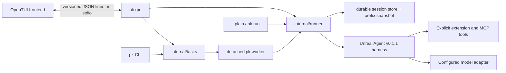

# Architecture and extension points

`pk` keeps terminal rendering, process control, durable work, and model execution in separate layers.
The command-line program is the composition root: it owns credentials and config, starts detached task
workers, or serves the local protocol used by the OpenTUI process.



The UI sends commands and renders events; it does not own model credentials or call the provider.
The Go `pk rpc` process resolves config, prepares the authenticated adapter, and passes turns to the
runner. `internal/tasks` persists a task manifest and append-only output events, then starts a
detached copy of the pk executable as the worker. `pk task attach` follows that event stream and can
be interrupted without stopping the worker. Cancellation is a separate command that signals the
worker. The TUI's `/tasks` picker and `/task` commands use the same task store through RPC.

## Progress and tool feedback

The runner emits assistant messages in provider order, excluding analysis content. Longer tasks are
prompted to send brief plans and factual milestone updates alongside tool work; these are ordinary
assistant messages, not hidden reasoning or timer-driven filler. Tool-call events carry a stable
`call_id`, name, running/completed/failed state, elapsed time, and bounded argument/command previews.
Operation summaries can include bounded shell output/error excerpts and exit codes. The OpenTUI adds
the first event as a chronological transcript row, then updates that row by `call_id` as work moves
from running to terminal, keeping completed results visible. Common secret fields and credential
assignments are redacted from previews; this is a defensive display filter, not a complete secret
detector. The Go `pk run --jsonl` interface exposes these runner events for scripts.

Detached tasks receive follow-up prompts and persisted `AskUser` questions through their task host.
Questions and explicit answers are keyed by task and tool-call ID, stored privately, and restored on
attach. The task remains running while waiting; dismissal does not cancel it. Foreground questions
use an in-memory broker and Escape cancels the turn. Both hosts feed answers into the original tool
call. See [durable task questions](task-questions.md) for recovery and lifecycle boundaries. `AskUser` is for clarifying decisions, not permission to execute a tool. See
[the harness interaction note](research/harness-interactions.md).

`internal/runner` composes the pinned Unreal Agent session coordinator, durable session storage,
operation manager, tool registry, and model adapter. The `llm.Adapter` boundary isolates model
requests. The upstream local operation manager executes durable Bash and image operations; pk also
registers explicit remote-job handlers for supported extensions. The base tool registry exposes
Bash, ViewImage, SkillUse, WriteFile, and EditFile. The dedicated file tools make atomic UTF-8
changes within the workspace, reject symlink paths, and return concise results. EditFile requires
an exact match and rejects ambiguous replacements unless explicitly asked to replace all.
Files are limited to 2 MiB; parent directories must already exist. WriteFile requires
`overwrite=true` to replace a file. EditFile optionally accepts `expected_sha256`; this
is a stale-content check, not a lock against other processes. Bash remains available
for broader filesystem operations. Host setup may add AskUser in interactive or detached-task hosts, explicitly configured
extensions, MCP servers, image generation, and parent-managed subagent tools through registry
decorators. These are opt-in integrations, not binaries discovered by scanning a workspace.

## What pk inherits from Unreal Agent

The pinned dependency is `github.com/unreallabsai/unreal-agent` v0.1.1. pk calls its production
`coordinator.New` and `operation.NewLocalOperationManager`; it does not replace the coordinator with
a pk polling loop. The coordinator dispatches independent tool calls returned together by the model
and folds their completed operation results into later model turns. This is an inherited execution
capability, not a claim that the model always chooses parallel calls. A deterministic integration
test uses a file-marker rendezvous to verify that two independent Bash calls overlap and both results
reach the next request: [`TestRunDispatchesIndependentToolsConcurrentlyAndWaitsForBoth`](../internal/integration/runner_test.go).

The upstream Bash tool captures complete stdout/stderr and can return references to capture files
when model-visible output is truncated. pk retains that path by default; an optional, separate
default-off pk policy can summarize oversized captured results while preserving their full local
artifacts. Upstream capture-path tests are linked in the [foundation audit](unreal-foundation-audit.md).

Unreal's context builder stages new inputs and tool results after the committed conversation prefix.
Its coordinator passes the session ID as the provider cache key. pk freezes the prompt, tool schemas,
and skill contents in a local context snapshot so resumes keep the same prefix; the model/effort may
change. The adapter reports provider-returned cached-token counters when available. A stable prefix
and key can support reuse, but cache hits, lifetime, token savings, or latency gains are not promised.

Unreal also provides skill discovery and an on-demand SkillUse operation. pk keeps that mechanism,
deduplicates canonical skill paths, and saves the exact skill bytes in the session snapshot. Changes
to a captured skill do not silently alter a resumed session; create `/new` to load changed
instructions. Source links and test limits are collected in the [Unreal foundation audit](unreal-foundation-audit.md).

## Context reuse and cache reporting

Each session has a stable prefix snapshot containing its workspace, system instructions, registered
tool schemas, and the skill documents captured at session start. Changing the model or reasoning
effort does not rewrite that snapshot. On resume, pk restores the same prefix and continues the same
durable session. This keeps repeated requests structurally consistent and avoids silently changing
instructions when a skill file is edited later. Starting a fresh session with `/new` captures the
current system instructions and skill contents; an existing session continues using its saved
snapshot.

The OpenAI Responses API cache is implicit and provider-controlled. The adapter passes the stable
session ID through the runtime's cache-key field, and keeping a long stable prefix can make reuse more
likely. It does not promise a hit or a particular cache lifetime. For each response with usage data,
`pk run --jsonl` emits a `usage` event with `input_tokens`, `output_tokens`, `reasoning_tokens`,
`cached_input_tokens`, and `cache_write_input_tokens`. The two cache counts have matching
`*_available` booleans, and `usage_available` indicates whether raw provider usage was present. A
zero is a reported zero only when its availability boolean is true; otherwise the backend did not
provide that count. If all usage values are absent or zero, no usage event is emitted. These are
provider-returned counters, not local estimates. Other provider adapters may expose different usage
details. See the [OpenAI prompt-caching guide](https://developers.openai.com/api/docs/guides/prompt-caching)
for the provider's current caching behavior.

For an in-repository Go host, [`runner.Options.ContextSnapshots`](../internal/runner/runner.go)
accepts the [`ContextSnapshotStore`](../internal/runner/context_snapshot.go) interface with
`LoadContext` and `SaveContext` methods. A host can use this seam to store the exact prefix snapshot
alongside a custom session store. `runner.Options.Adapter` accepts a host-provided Unreal
`llm.Adapter`. `BuilderFactory` and `RegistryFactory` are seams for composing context and the tool
registry. These types live below Go's `internal/` boundary; they are not a stable external Go package
or a runtime plugin API. A custom registry still needs operations the selected operation manager can
execute. Adding a tool with a new side effect also requires a compatible durable operation path.

## Supported ways to extend a user setup

Add instructions and repeatable workflows as skills. For example, create
`~/.codex/skills/review-pr/SKILL.md` and pk can discover it on the next new session. In direct mode,
`--skills-dir PATH` selects one or more custom roots instead of the defaults. Existing sessions keep
the skill content captured in their prefix snapshot.

Choose the model and effort in config, from a CLI override, or in the TUI pickers:

```sh
pk config set model gpt-6-luna
pk config set effort medium
pk task create --workspace ../pk-review --model gpt-6-luna --effort high \
  -p "Review the code and summarize the highest-risk issues."
```

The default model is `gpt-6-luna`; the default effort is `medium`. The model must support the chosen
effort. The task flags set values for that task and leave the saved defaults alone.

## Local state boundaries

By default, pk stores its own config and credentials in `~/.pk`, session history in
`~/.pk/sessions`, and detached task manifests/events/logs in `~/.pk/tasks`. `PK_HOME` moves all of
these together. Workspace files remain in the selected workspace. The Bash operation runs with the
host user's permissions; workspace selection is not a sandbox.
