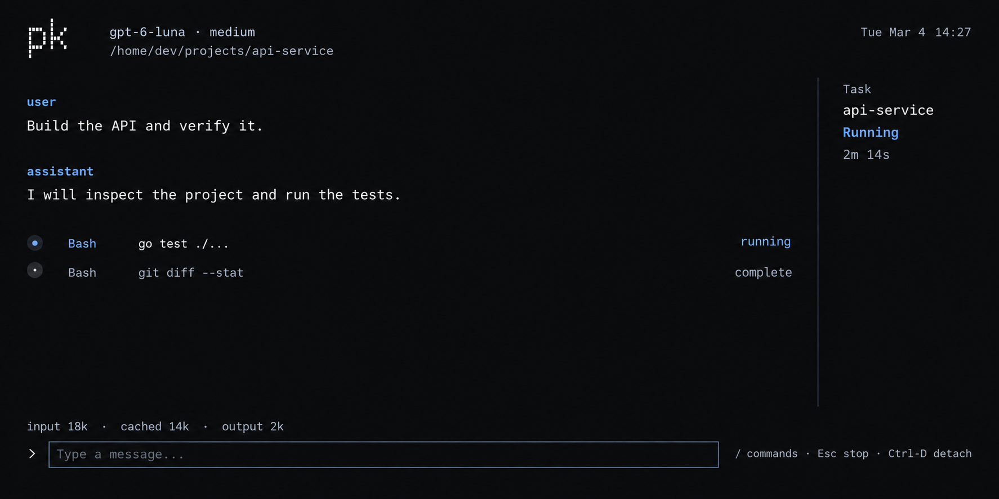
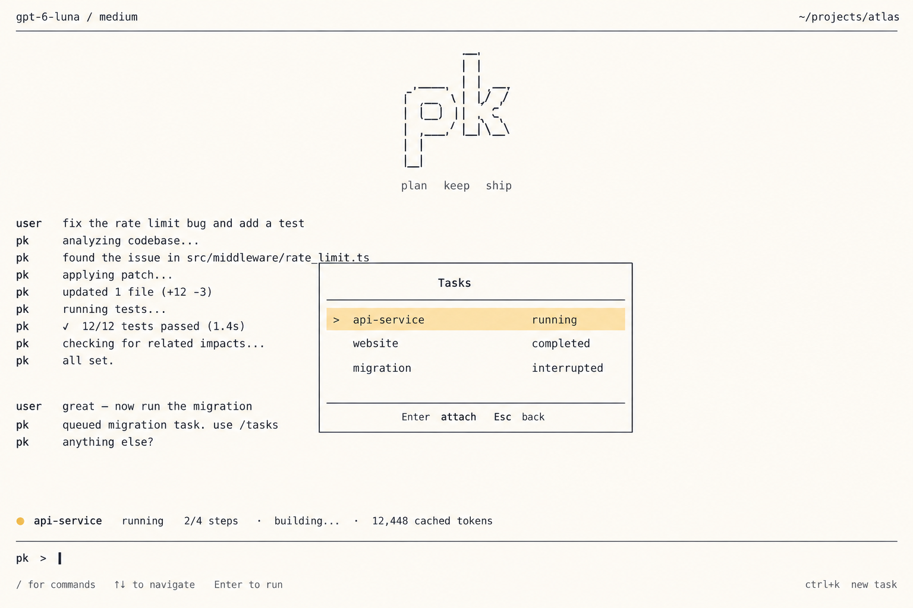

# OpenTUI concept references

These three ImageGen mockups are visual concepts for pk. They are not screenshots of the current
application and should not be read as a feature checklist. The working UI is an OpenTUI/React
terminal program; its present commands and keyboard controls are documented in
[Getting started](../getting-started.md).

## Dark welcome screen

The welcome concept gives an empty conversation a clear starting point, shows the current workspace,
and makes a few slash commands discoverable. The implemented command menu is smaller and reflects
commands that actually work.

## Active task conversation

The conversation concept prioritizes the user's request, the agent's reply, and visible tool
progress. Its cache and token display is aspirational: show usage only when it comes from response
usage data, and do not present a cache hit as guaranteed.

## Light task picker

The light task-picker concept explores a distinct selection surface. The implemented `/tasks` picker
lists durable detached tasks; saved conversation sessions are opened with `/attach SESSION_ID`.

## Interaction references

OpenTUI's [React bindings](https://opentui.com/docs/bindings/react/) informed the choice to build the
interface as a React component tree on a native terminal renderer. The [Codex slash-command
catalog](https://github.com/openai/codex/blob/main/codex-rs/tui/src/slash_command.rs) and
[command-popup implementation](https://github.com/openai/codex/blob/main/codex-rs/tui/src/bottom_pane/command_popup.rs)
were references for a finite command catalog, readable descriptions, prefix filtering, a useful
presentation order, and resetting or clamping selection as the result list changes. pk's menu is a
separate implementation with its own command set and keyboard behavior; it does not copy Codex code.

The layout should continue to work in a narrow terminal: keep command descriptions short, limit the
visible result list, reset an out-of-range selection after filtering, and use the same command list
for display and dispatch so the menu never advertises a command the UI cannot handle.
