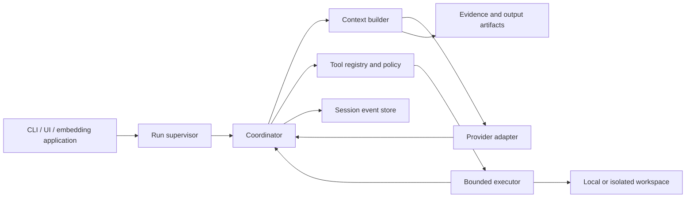

# pk: initial research and direction

22 September 2026 · Exploratory decision brief

Four GPT-6 Luna research agents investigated Unreal Agent, Pi and adjacent projects, context/tool engineering, and Go runtime design. This brief synthesizes those investigations and adds an evaluation plan. Sources are linked throughout the individual notes. No runtime has been implemented, upstream benchmarks reproduced, or performance advantage measured.

## Recommendation

Build toward a **small Go harness with inspectable execution and deliberate context management**. Start with a library and headless CLI; keep the interactive UI separate. The first product hypothesis is: retain Pi's composability while improving bounded resource use, background execution, recovery, and visibility into what the model actually sees.

**Updated after source inspection:** build on Unreal Agent first, using its pinned public Go packages behind a pk-owned host. The [deeper investigation](unreal-deep-dive.md) and [passing external-module spike](../../experiments/unreal-composition/README.md) supersede the initial preference for an independent core. Preserve its asynchronous runtime and session machinery; fork only when a concrete interface limitation blocks a pk feature.

Go is a reasonable first choice for this process- and network-heavy workload. It gives us direct access to subprocesses, streaming HTTP, cancellation, and profiling in one toolchain. Rust becomes worth revisiting if measured memory or CPU constraints make the Go runtime a material limitation. Neither language choice alone improves model reasoning or accelerates remote inference. See [runtime tradeoffs](go-runtime.md).

## What the research changed

- **Unreal Agent is already Go and MIT licensed.** Its public releases are dated September 22. Its useful architectural contribution is separating tool-call acceptance from durable asynchronous operations and context assembly. See the [source audit](unreal-agent.md) for release records, inspected revision, and reuse considerations.
- **Its benchmark story is promising but narrower than “SOTA.”** The vendor reports lower costs and comparable or higher success on selected evaluations; one Codex comparison uses a leaderboard baseline. We have not independently replicated these results. The [audit](unreal-agent.md) records the figures and caveats.
- **Pi sets a serious extensibility baseline.** It already has provider abstractions, steering, persistent branching sessions, compaction, and rich TypeScript extensions. A Go rewrite alone is not a differentiator. See [Pi and the landscape](pi-and-landscape.md).
- **Context and execution policy are the main experimental surface.** On-demand tools, retrievable output artifacts, stable prompt prefixes, structured checkpoints, and bounded delegation are worth testing individually. Published findings remain model- and workload-dependent. See [context and tools](context-and-tools.md).

## Proposed architecture

The session log is the record of what happened; model context is a selected view of it. Store large outputs as artifacts and expose bounded excerpts with references. A context build should explain every omission, truncation, and checkpoint substitution. This makes token savings debuggable and allows users to inspect the agent's evidence.

Tool metadata should describe schemas, capabilities, output bounds, timeouts, and effects. Start with read/search/patch/exec; add discovery when the catalog actually needs it. Parallelize independent reads and separate workspaces. Serialize writes that can conflict; do not ask the model to solve filesystem races.

Give every operation a stable identity and explicit lifecycle. Persist intent before dispatch and record completion afterward. Recovery must distinguish safe retries from uncertain external side effects: an append-only log does not create exactly-once execution. Cancellation must terminate and reap descendants, not just stop the model request.

Keep integrations outside the coordinator. A subprocess protocol or MCP adapter can support extensions in different languages; process separation alone is not a sandbox. Defer a bespoke plugin VM and embedded inference until there is an actual requirement.

## First implementation sequence

| Stage | Deliverable | Decision gate |
| --- | --- | --- |
| Foundation spike | Public-package import and context-prefix checks now pass; next exercise a complete hosted run, cancellation, and resume | Use pinned Unreal; document specific interface gaps before forking |
| Minimal vertical slice | Go library + CLI; one provider; core tools; bounded output; durable sessions; fake provider fixtures | Complete a repository task and survive cancellation/crash fixtures without silent state loss |
| Controlled baseline | Same-model runs against pinned Pi and Unreal, plus local runtime measurements | Establish quality, cost, latency, and resource baselines before choosing numerical targets |
| Context experiments | Tool discovery, output retrieval, checkpoints, cache layout; one change at a time | Keep changes only when measured quality/cost tradeoffs improve |
| Product layer | Streaming UI, extension ergonomics, optional bounded workers | Preserve core reliability and show benefits on real workflows |

The [evaluation plan](evaluation-plan.md) specifies task families, controls, metrics, and ablations. “Better than Pi” should become a reproducible claim about a stated workload, not a blanket launch slogan.

## Assumptions to revisit

The initial target is a local coding harness with hosted model APIs, macOS/Linux execution, and eventual language-neutral extensions. Local inference, Windows support, remote workers, and compatibility with Pi extensions remain open design choices. These assumptions narrow the first experiment; they are not permanent product commitments.

The public README deliberately remains a short coming-soon teaser. This directory is the working research deliverable, not a specification or release announcement.
