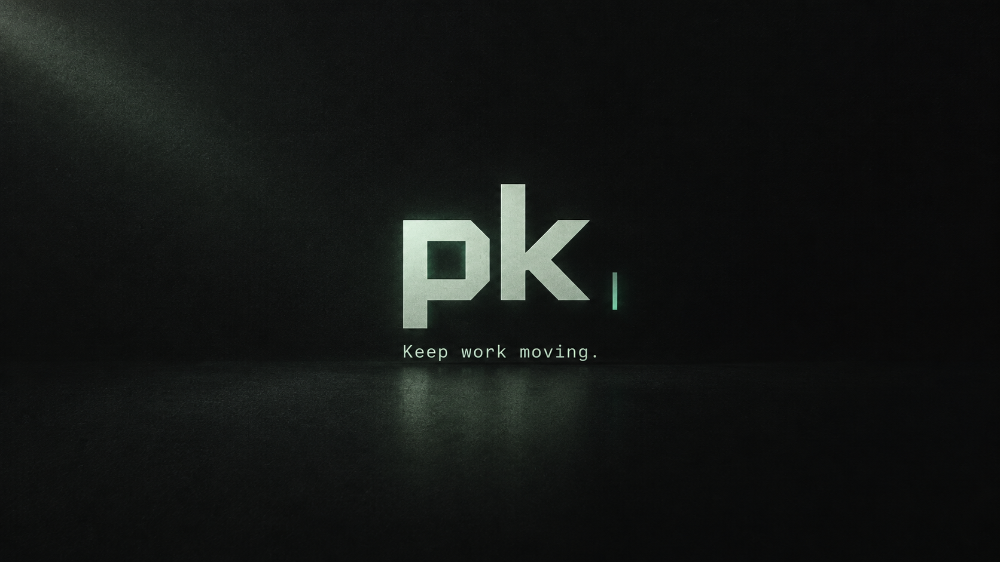
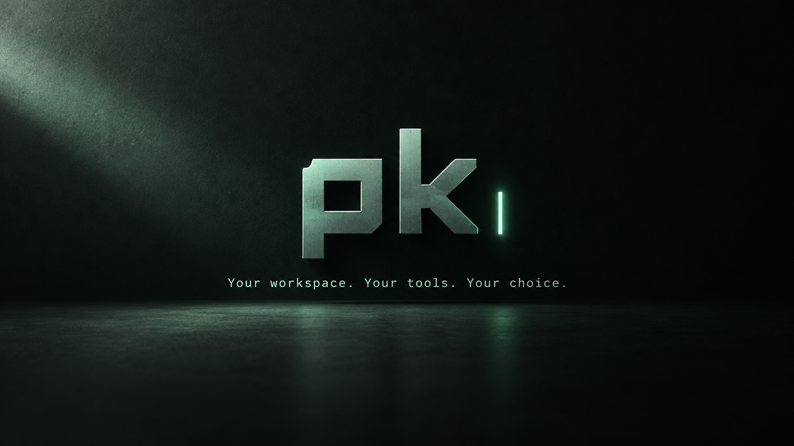

# pk launch kit

Review-ready artwork, not product screenshots. Generated with imagegen; nothing has been posted to social media.

## Keep work moving

## Your workspace, your tools, your choice

## Mint cursor

[Uncaptioned artwork](pk-mint-cursor.png)

## Use with

- [Draft X posts and claim boundaries](../../docs/launch-copy.md)
- [Real coding-session screenshot](../../docs/assets/pk-coding-session.png)
- [Reusable video editor and recording notes](../../scripts/demo-edit/README.md)
- Local edited demo: `/Users/preetham/Movies/pk-launch-demo/pk-coding-demo.mp4`
- [Earlier TUI concepts](../imagegen/)

The demo records a real bounded coding task. The artwork and copy do not claim benchmark superiority or universal token savings. Review the [benchmark results](../../docs/benchmark-findings.md) before publishing comparisons.
